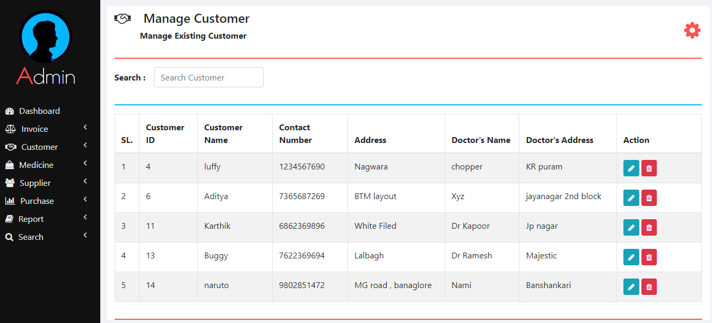
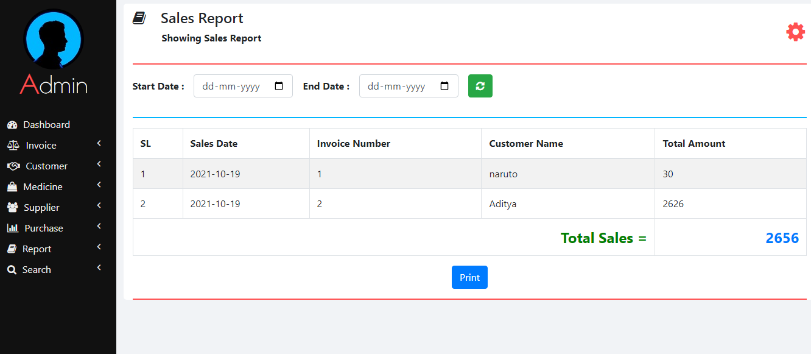

# Pharmacy-Management System

## Screenshots

*Dashboard view showcasing the overall summary and insights.*

*Customer management interface where you can add, edit, and delete customer records.*

*Medicine management interface for handling medicine inventory.*

*Supplier management section for adding, editing, and removing supplier details.*

*Sales management area for processing and tracking sales.*

*Purchase management section to oversee and record purchases.*

## About The System

The Pharmacy Management System is a web application built with PHP, JavaScript, Bootstrap, and CSS. This project is designed to help pharmacy owners manage their business efficiently. It features an admin side section where all management tasks are handled, such as adding, editing, and deleting records for customers, medicines, suppliers, sales, and purchases. The primary goal of this system is to provide a streamlined process for pharmacy management.

## Features

- **View Dashboard**
- **Customer Management**
  - View all customers
  - Add customer
  - Edit customer
  - Delete customer
- **Medicine Management**
  - View all medicines
  - Add medicine
  - Edit medicine
  - Delete medicine
- **Supplier Management**
  - View all suppliers
  - Add supplier
  - Edit supplier
  - Delete supplier
- **Sales Management**
  - View all sales
  - Add sale
  - Edit sale
  - Delete sale
- **Purchase Management**
  - View all purchases
  - Add purchase
  - Edit purchase
  - Delete purchase
- **Reports**
  - View sales and purchase reports

## Login Details

- **Username:** admin
- **Password:** admin123

## How To Run The Project

To run this project, you must have a virtual server installed, such as XAMPP, on your PC (for Windows). This Pharmacy Management System in PHP is free to download and is intended for educational purposes only.

### Steps to Run

1. **Start Apache and MySQL in XAMPP.**
2. **Extract the project file.**
3. **Copy the main project folder.**
4. **Paste the copied folder into `xampp/htdocs/`.**

### Connecting to the Database

5. **Open a browser and go to URL** `http://localhost/phpmyadmin/`.
6. **Click on the Databases tab.**
7. **Create a database named** `pharmacy` **and click on the Import tab.**
8. **Click on Browse file and select the** `pharmacy.sql` **file.**
9. **Click on Go.**

### Running the Project

10. **Open a browser and go to URL** `http://localhost/Pharmacy-Management/`.

---
